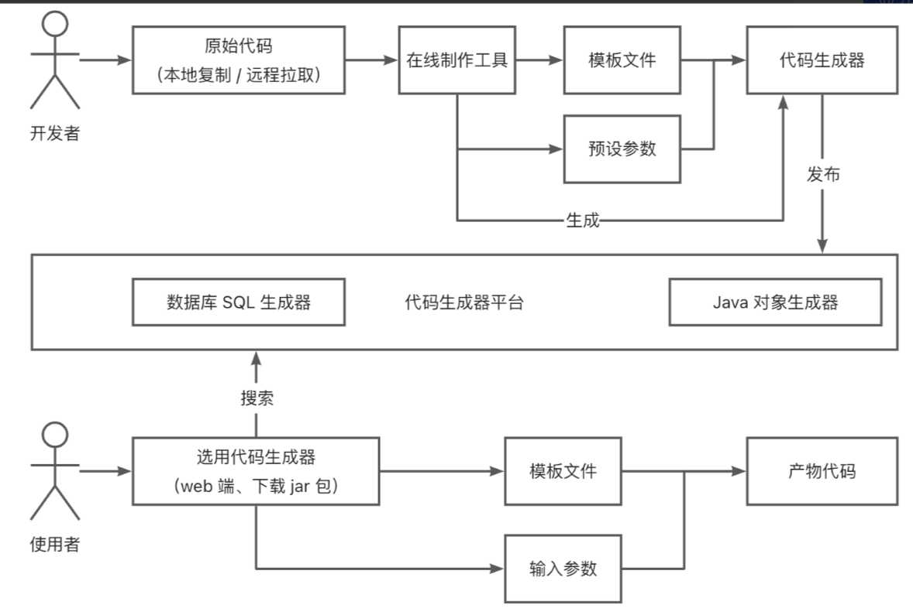
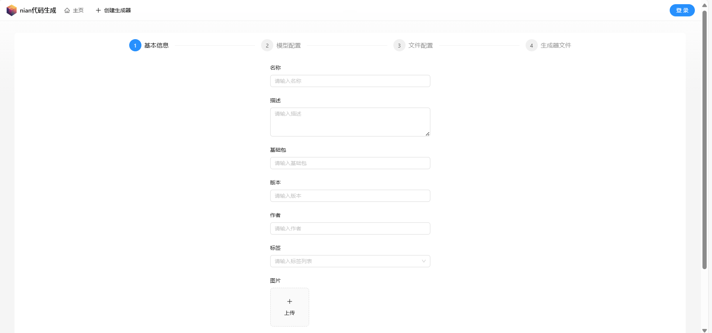
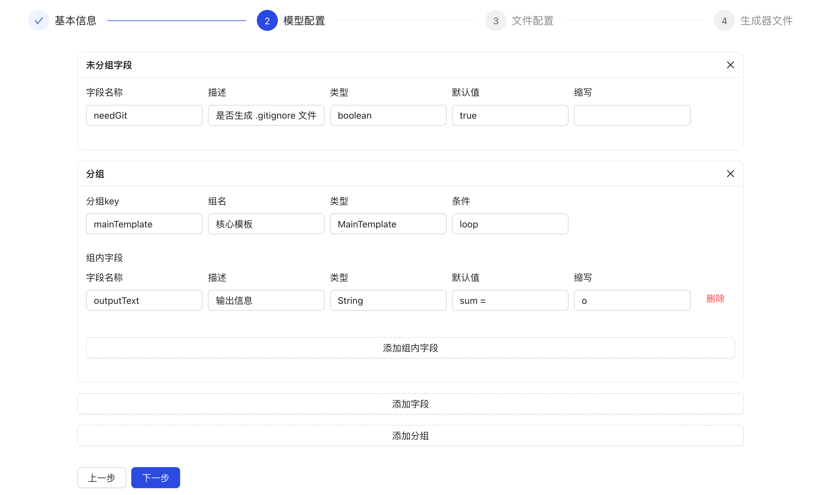
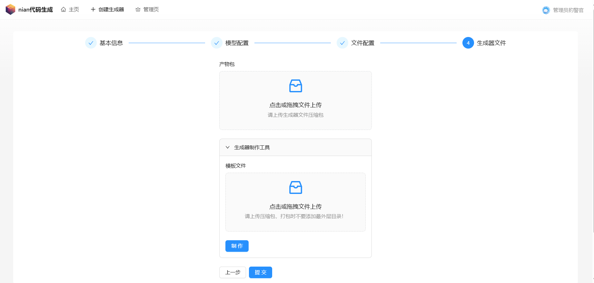
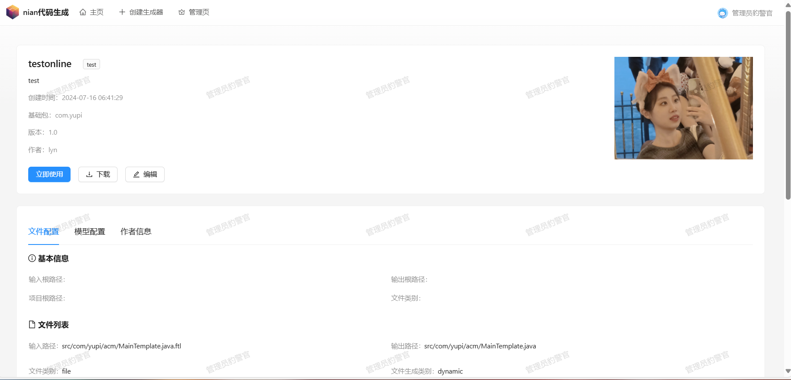
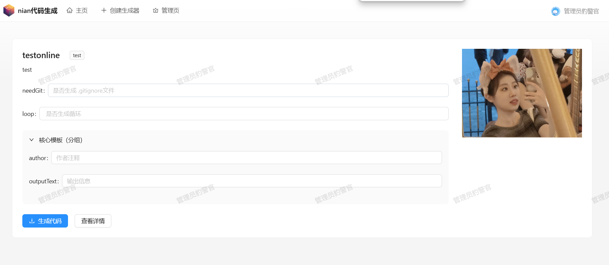

# nian-定制化代码生成项目
**在线访问地址** http://124.223.46.236:8000/

深入业务场景的企业级硬项目，基于 React + Spring Boot + Picocli + 对象存储的 代码生成器共享平台 。

开发者可以在平台上制作并发布代码生成器，用户可以搜索、下载、在线使用代码生成器，管理员可以集中管理所有用户和生成器。

## 项目简介

**分为三个项目**

**基于命令行的本地代码生成器、代码生成器制作工具、在线代码生成器平台。**

## 技术选型（全栈项目）

#### 前端

- React 18 开发框架
- Ant Design Pro 脚手架
- Ant Design 组件库
- ⭐️ Ant Design Procomponents 高级组件
- OpenAPI 代码生成
- 前端工程化：ESLint + Prettier + TypeScript
- ⭐️ 前端通用文件上传下载

#### 后端

- MySQL 数据库
- MyBatis-Plus 及 MyBatis X 自动生成
- Maven 自动打包
- ⭐️ Picocli Java 命令行应用开发
- ⭐️ FreeMarker 模板引擎
- ⭐️ Caffeine + Redis 多级缓存
- ⭐️ XXL-JOB 分布式任务调度系统
- ⭐️ 腾讯云 COS 对象存储
- ⭐️ 多种设计模式
  - 命令模式
  - 模板方法模式
  - 双检锁单例模式
- ⭐️ 多角度项目优化
  - 可移植性、健壮性、可扩展性、圈复杂度优化
  - 7 种性能优化思路和实践
  - 7 种存储优化思路和实践
- ⭐️ Vert.x 响应式编程
- ⭐️ JMeter 压力测试
- Hutool 工具库和 Lambda 表达式编程

#### 项目上线

- 轻量应用服务器
- 宝塔 Linux 面板
- Nginx 反向代理

## 项目展示

主页（代码生成器搜索列表）：

代码生成器创建页（分步表单）：

代码生成器创建页（复杂嵌套动态表单）：

在线上传和制作代码生成器：

代码生成器详情页：

在线使用代码生成器：

